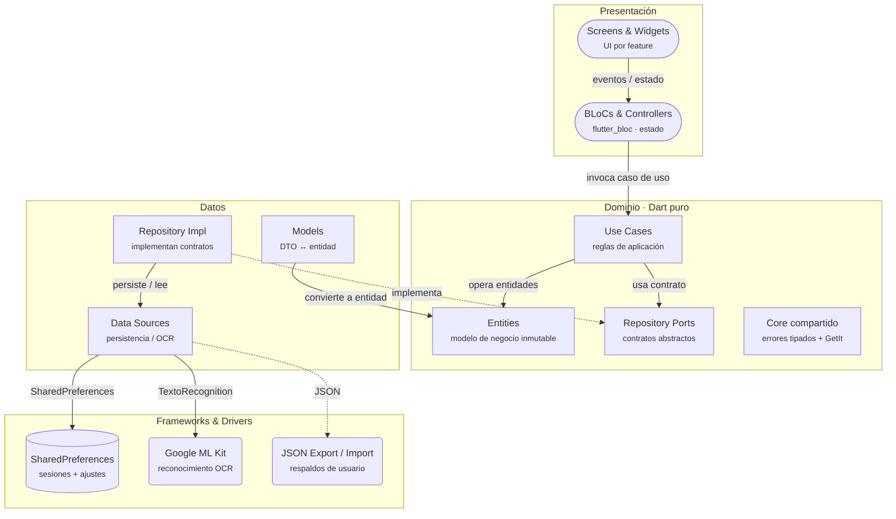
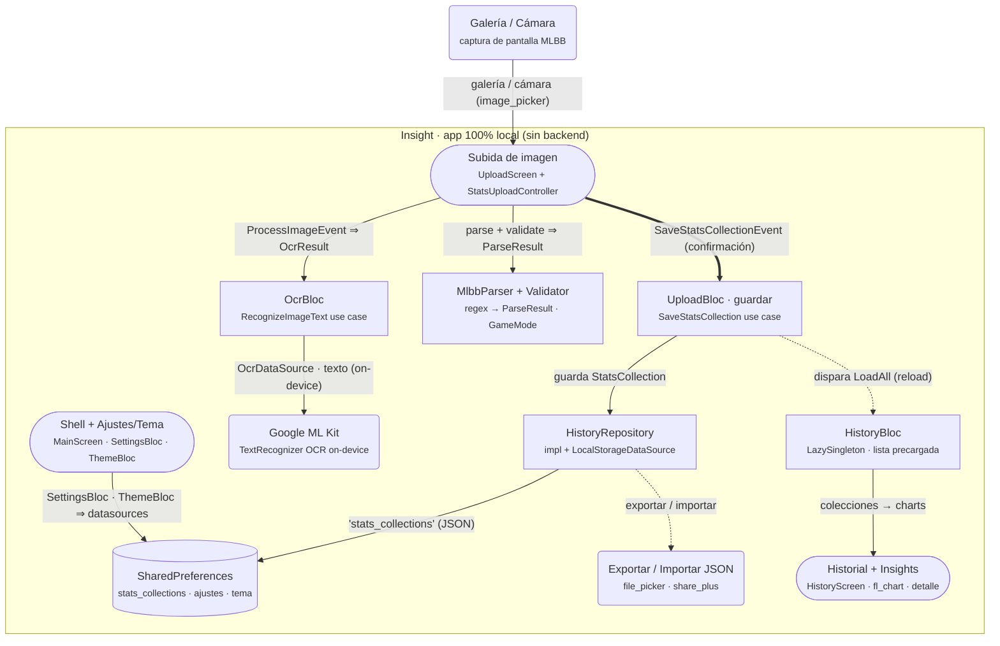
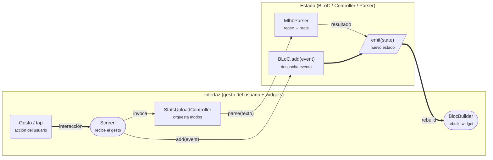

# Diagramas de Insight

Versiones **simplificadas** (Mermaid) de los diagramas del proyecto, con enlace directo a su
**versión interactiva** alojada en GitHub Pages.

> Dashboard completo: <https://rafael-vh.github.io/Insight/>

---

## Insight · Arquitectura limpia

Clean Architecture del proyecto: presentación, dominio y datos, con la regla de dependencia apuntando al centro.

> Versión interactiva: <https://rafael-vh.github.io/Insight/diagramas/insight-clean-architecture/>

---

## Insight · Cómo se relaciona el código

Cómo se relaciona el código del proyecto: OCR, historial, ajustes y persistencia con SharedPreferences.

> Versión interactiva: <https://rafael-vh.github.io/Insight/diagramas/insight-arquitectura/>

---

## Frontend · Flujo de interacción

Cómo viaja una interacción del gesto del usuario al redibujado del widget, por BLoCs y controllers.

> Versión interactiva: <https://rafael-vh.github.io/Insight/diagramas/frontend-interaccion/>

---

## Insight · Datos extraídos de stats MLBB

Del png de la partida al JSON guardado: OCR on-device, parseo por regex, validación y consumo local.

```mermaid
flowchart LR
  classDef backend fill:#dcfce7,stroke:#059669,color:#052e16;
  classDef database fill:#ede9fe,stroke:#7c3aed,color:#2e1065;
  classDef external fill:#e2e8f0,stroke:#64748b,color:#0f172a;
  classDef frontend fill:#dbeafe,stroke:#0891b2,color:#083344;
  classDef messagebus fill:#ffedd5,stroke:#ea580c,color:#431407;

  subgraph E0["Captura"]
    imagen(["Imagen de stats<br/><small>cámara o galería</small>"])
  end
  subgraph E1["OCR"]
    mlkit("ML Kit OCR<br/><small>TextRecognizer · latin</small>")
  end
  subgraph E2["Parseo"]
    texto[["Texto plano<br/><small>recognizedText · \n</small>"]]
    parser["StatsParser<br/><small>22 regex sobre el string</small>"]
  end
  subgraph E3["Validación"]
    performance[("PlayerPerformance<br/><small>25 campos numéricos</small>")]
    validator["StatsValidator<br/><small>faltantes / advertencias</small>"]
  end
  subgraph E4["Almacén y consumo"]
    storage[("Colección local<br/><small>JSON · key stats_collections</small>")]
    consumers(["Consumo<br/><small>Historial · insights</small>"])
  end

  imagen == "archivo de imagen<br/>captura" ==> mlkit
  mlkit == "texto reconocido<br/>OCR" ==> texto
  texto == "fullText<br/>entrada del parser" ==> parser
  parser == "22 campos extraídos<br/>parseo" ==> performance
  performance -- "estado por campo<br/>validación" --> validator
  validator == "guardar sesión (válida)<br/>manual" ==> storage
  storage -- "lectura<br/>CRUD · export · gráficos" --> consumers
```

> Versión interactiva: <https://rafael-vh.github.io/Insight/diagramas/mlbb-extraccion/>
